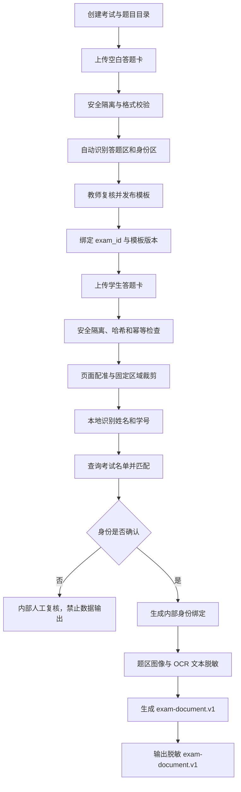

# 生成式人工智能教育文件识别与数据脱敏整改方案

版本：v1.1  
编写日期：2026-07-19  
适用模块：考试文件识别模块、学生绑定模块、数据脱敏和结果交付层  
适用场景：大学思政课期末考试的试题卷、空白答题卡、学生答题卡识别
本方案不负责：批改建议、评分模型、教师评分复核、正式成绩写入和批改模块内部安全

## 1. 方案结论

当前思路可行，但不能把“脱敏”理解为简单删除 JSON 中的姓名和学号字段。正确做法是把学生身份处理划分为一条受控的内部链路，把答题内容处理成另一条脱敏链路：

```text
学生答题卡原件
    -> 安全上传与隔离
    -> 固定模板配准和题区裁剪
    -> 本地识别姓名/学号
    -> 查询考试名单并完成身份绑定
    -> 生成仅含题号和答案的脱敏答题数据
    -> 输出兼容接口的脱敏题目和答案数据
```

核心原则：

1. 姓名、学号只在识别服务内部用于身份绑定，不进入下游数据输出。
2. 下游模块只接收既有 `exam-document.v1` 中的 `questions[]` 或 `answers[]`，不读取原始文件、身份 OCR、考试名单和身份映射表。
3. `POST /api/process` 的输入字段不变，成功输出结构不变，不向 `questions[]` 或 `answers[]` 增加学生姓名和学号。
4. 原始文件不能因为对外脱敏而直接删除。原始文件仍需在受控内部存储中保留，用于身份复核、识别纠错和成绩争议处理。
5. 本模块只负责识别、绑定和脱敏；评分、批改建议和正式成绩由其他模块负责，不在本模块实现。

本次修订增加了政策层级区分：

- 中国法律、行政法规和部门规章，是项目必须进行合规评估的直接依据。
- 中国官方部门发布的政策和监管文件，是教育机构制定制度和采购要求的重要依据。
- UNESCO、英国教育部、欧盟和 NIST 文件，是国际教育 AI 治理与工程安全参考，不应写成当前中国项目的直接法律依据。

政策原文摘录、出处、适用边界和可直接写入项目材料的表述，另见[《生成式人工智能教育识别与脱敏政策素材库》](生成式人工智能教育批改政策素材库.md)。

## 2. 当前版本兼容边界

### 2.1 现有识别接口保持不变

现有接口继续使用：

- `POST /api/process`
- `POST /api/templates/drafts`
- `GET /api/submissions/{submission_id}`
- 现有考试、模板和题目目录管理接口

`POST /api/process` 仍使用以下输入字段：

| 字段 | 说明 |
|---|---|
| `file` | 试题卷或学生答题卡文件 |
| `document_role` | `question_paper` 或 `answer_sheet` |
| `exam_id` | 试题卷保存题目目录，答题卡解析时查询绑定模板 |
| `submission_id` | 调用方提供的稳定幂等标识，可不传 |

不新增 `student_name`、`student_no`、`student_id`、`identity_layout` 等外部请求字段。身份信息由服务端从答题卡固定区域识别并在内部处理。

### 2.2 现有成功输出保持不变

输出仍使用 `exam-document.v1`：

- 试题卷输出 `questions[]`
- 学生答题卡输出 `answers[]`
- 固定答题卡继续输出 `template_id`、`template_name`、`template_version`
- 题目、模板和答题结果继续使用同一套 `question_id`
- 不在成功输出中增加姓名、学号、手机号或任何学生名单字段

脱敏后的答题结果示例：

```json
{
  "schema_version": "exam-document.v1",
  "submission_id": "sub_01H8K2M7Q4",
  "exam_id": "mayuan_1516",
  "exam_name": "马原15-16期末试卷",
  "document_role": "answer_sheet",
  "layout_type": "fixed",
  "template_id": "tpl_mayuan_1516_v1",
  "template_name": "马原15-16答题卡",
  "template_version": 1,
  "answers": [
    {
      "question_id": "2.1",
      "question_no": "2.1",
      "answer_text": "学生作答文本",
      "is_blank": false,
      "page_nos": [1],
      "confidence": 0.83,
      "needs_review": false,
      "risk_flags": []
    }
  ]
}
```

这里的 `submission_id` 必须是不可推断学生身份的随机或不可逆业务标识。调用方不能把姓名、学号或手机号拼接到 `submission_id` 中。

### 2.3 数据处理目的与最小化

本模块必须建立数据处理清单，禁止以“后续可能有用”为理由长期保存或外发全部字段：

| 数据项 | 处理目的 | 必要范围 | 保存位置 | 对外模型 |
|---|---|---|---|---:|
| 姓名区域图像 | 本地身份核验 | 仅模板定义的身份框 | 身份隔离区 | 否 |
| 学号区域图像 | 本地名单匹配 | 仅模板定义的身份框 | 身份隔离区 | 否 |
| 姓名、学号 OCR | 建立学生绑定 | 仅用于匹配和复核 | 身份库，密文 | 否 |
| 题区图像 | 识别学生答案 | 仅按题区裁剪 | 脱敏处理区 | 否，由本地识别处理 |
| `answer_text` | 输出识别后的答案文本 | 仅当前题答案 | 脱敏结果库 | 默认不外发原始内容 |
| 原始文件名、路径、调试信息 | 运维追踪 | 不进入提示词 | 审计日志，最小化 | 否 |

每个考试在开始处理前应记录：处理目的、数据类型、使用系统、访问角色、保留期限、是否使用外部模型、外部供应商和人工复核责任人。考试结束后按学校数据保留制度归档或删除，不能无限期保留。

## 3. 数据分层与权限边界

### 3.1 数据分层

| 层级 | 内容 | 是否允许进入外部 AI | 访问主体 |
|---|---|---:|---|
| L0 原始层 | 原始答题卡、原始扫描文件、原始文件名 | 否 | 识别服务、授权教师复核 |
| L1 身份层 | 姓名/学号区域图像、身份 OCR、名单匹配结果、身份映射 | 否 | 身份绑定服务、极少数审计人员 |
| L2 脱敏中间层 | 题区裁剪图、清洗后的 OCR 文本、脱敏清单 | 不外发原始数据 | 识别服务、结果交付层 |
| L3 对接层 | `exam-document.v1` 的 `questions[]` 或 `answers[]` | 由下游模块自行评估 | 授权下游系统 |
| L4 下游业务层 | 批改建议、人工批注、正式成绩 | 不属于本模块 | 其他业务模块 |

### 3.2 权限隔离

识别模块拥有：

- 读取安全放行后的原始答题卡
- 读取固定模板和身份区域配置
- 写入身份绑定记录
- 生成脱敏答题结果

下游数据接收模块只拥有：

- 读取脱敏的 `questions[]` 和 `answers[]`
- 使用 `submission_id`、`exam_id`、`question_id` 建立业务关联
- 读取已经放行的脱敏结果

下游数据接收模块明确禁止：

- 读取原始答题卡图片
- 读取姓名/学号区域裁剪图
- 读取考试学生名单
- 读取 `submission_id -> student_id` 映射表
- 通过文件路径、静态资源 URL 或调试接口绕过脱敏层

## 4. 固定答题卡身份区域方案

### 4.1 为什么需要旁路身份布局

当前公开模板结构的 `pages[].regions[]` 面向题目答题区域，每个区域要求有 `question_id` 和 `question_no`。姓名和学号不是题目，不能伪装成题目区域，否则会破坏 `question_id` 对齐和现有 Schema。

因此，姓名和学号区域使用模板目录下的内部旁路文件保存，不改变公开模板 JSON 和 `exam-document.v1`：

```text
storage/templates/{template_id}/identity_layout.json
```

### 4.2 身份布局示例

```json
{
  "template_id": "tpl_mayuan_1516_v1",
  "template_version": 1,
  "exam_id": "mayuan_1516",
  "regions": [
    {
      "region_id": "student_name",
      "page_no": 1,
      "bbox": [0.12, 0.08, 0.38, 0.14],
      "coordinate_type": "normalized",
      "ocr_mode": "printed_or_handwriting",
      "required": true
    },
    {
      "region_id": "student_no",
      "page_no": 1,
      "bbox": [0.58, 0.08, 0.91, 0.14],
      "coordinate_type": "normalized",
      "ocr_mode": "digits_or_handwriting",
      "required": true
    }
  ]
}
```

### 4.3 模板生成和复核

空白答题卡模板生成时，服务端按以下顺序处理：

1. 识别“姓名”“学号”等打印标签及其相邻空白书写框。
2. 根据页面配准结果计算归一化坐标。
3. 将候选身份区域写入 `identity_layout.json`。
4. 对答题区继续生成现有 `pages[].regions[]` 候选区域。
5. 模板进入 `pending_review`，教师复核答题区和身份区。
6. 身份区缺失、重叠、越界或未确认时，禁止发布模板。
7. 模板发布后，身份区域配置和答题区域配置都视为不可变；修改必须生成新的模板版本。

为保持现有识别接口不变，身份区复核可以增加独立的模板管理接口，例如：

```text
PUT /api/templates/{template_id}/identity-review
POST /api/templates/{template_id}/identity-publish
```

这两个接口属于模板管理面的新增能力，不修改现有 `/api/process` 的输入和输出结构。若产品暂时不增加管理接口，也必须由模板生成服务在发布前完成身份区域确认，不能默认为“没有身份区也可以处理学生答题卡”。

身份区域配置还必须绑定模板版本摘要。处理学生答题卡时，服务端同时校验 `template_id`、版本和布局摘要；任何一个不一致都不能继续裁剪，防止旧模板坐标被错误套用到新答题卡。

## 5. 学生身份绑定流程

### 5.1 前置条件

处理学生答题卡前必须满足：

- `exam_id` 存在
- 考试已保存题目目录
- 考试已绑定已发布模板
- 模板版本明确
- 模板存在已确认的姓名和学号身份区域
- 考试名单已导入或可由后端查询
- `submission_id` 未被其他考试或其他文件占用

### 5.2 本地身份识别

答题卡处理时，身份识别只在后端本地执行：

```text
原始答题卡
 -> 页面配准
 -> 读取 identity_layout.json
 -> 裁剪姓名区和学号区
 -> 图像预处理
 -> 本地 OCR
 -> 文本归一化
 -> 格式校验
```

姓名和学号区域不得发送到外部大模型或外部 OCR 平台。手写姓名识别不确定时，保留原始身份区域供授权人员内部复核，但不将该图像交给任何下游系统。

### 5.3 归一化和校验

姓名归一化包括：

- 去除首尾空白和不可见控制字符
- 统一全角/半角字符
- 删除明显的 OCR 噪声符号
- 保留汉字，不把相似字自动替换为高置信结论

学号归一化包括：

- 仅允许考试配置规定的长度和字符集
- 统一数字与常见 OCR 混淆字符
- 使用校验位或固定前缀时进行格式验证
- 不允许凭模糊 OCR 结果直接截断或补齐学号

### 5.4 名单匹配规则

建议采用“学号主键、姓名校验、低置信转人工”的策略：

| 情况 | 处理结果 |
|---|---|
| 学号高置信精确命中，姓名一致 | 自动绑定 |
| 学号精确命中，姓名存在少量可解释 OCR 差异 | 进入人工复核，不直接放行 |
| 学号命中多个候选或学号格式不合法 | 人工复核 |
| 学号未命中但姓名唯一命中 | 人工复核，不允许仅凭姓名自动绑定 |
| 姓名和学号均未命中 | 阻断向下游输出 |
| 答题卡身份区为空 | 标记缺失，阻断向下游输出 |
| 身份区被涂改或多次书写 | 标记冲突，阻断向下游输出 |

自动绑定必须同时通过：

```text
考试名单存在
 + 学号格式合法
 + 学号唯一命中
 + 姓名校验通过
 + OCR 置信度达到阈值
 + 文件哈希和模板版本未冲突
```

### 5.5 内部绑定记录

建议使用独立的 `student_identity_binding` 表或等价持久化记录：

```json
{
  "binding_id": "bind_01H8K2M7Q4",
  "submission_id": "sub_01H8K2M7Q4",
  "exam_id": "mayuan_1516",
  "template_id": "tpl_mayuan_1516_v1",
  "template_version": 1,
  "student_id_ciphertext": "encrypted-value",
  "student_name_ciphertext": "encrypted-value",
  "identity_status": "matched",
  "match_method": "student_no_exact_name_verified",
  "source_file_sha256": "...",
  "created_at": "2026-07-18T10:00:00Z"
}
```

要求：

- 姓名和学号加密存储或使用受控密钥管理的密文列。
- 查询绑定表必须有独立权限，下游服务账号没有读取权限。
- `submission_id` 对一个考试、一个文件哈希、一个模板版本只能绑定一个学生。
- 同一 `submission_id` 重试时必须命中现有绑定和处理结果，不重复 OCR、不重新绑定。
- 同一 `submission_id` 换文件、换考试或换模板版本时必须拒绝，防止身份覆盖。
- 绑定写入和结果放行必须是同一事务或具备等价的原子状态转换。
- 身份绑定记录必须保存匹配规则版本、OCR 引擎版本、置信度、人工复核状态和证据文件引用，保证事后可以解释“为什么绑定到这个学生”。

## 6. 脱敏处理流程

### 6.1 图像脱敏

学生答题卡的脱敏图像只保留题目答题区域：

1. 先按已发布模板进行页面配准。
2. 只裁剪 `content_type=answer` 的题区。
3. 永不把完整答题卡页面发送给下游系统或外部模型。
4. 对题区重新编码，移除 EXIF、文件名、扫描设备信息等元数据。
5. 检查题区边界，确保不包含姓名、学号、手机号和其他身份区域。
6. 如果学生在答案正文中主动写出姓名、电话、地址等信息，进入文本脱敏和人工复核。

### 6.2 OCR 文本脱敏

脱敏不是只删除固定字段，还要检查答案正文和日志：

- 姓名：与考试名单做受控匹配，替换为 `[学生姓名]`。
- 学号：匹配学号格式，替换为 `[学生学号]`。
- 手机号、身份证号、邮箱、地址：使用规则检测并替换。
- 家庭信息、心理健康信息、思想汇报等敏感内容：按业务规则分类，默认不发送给外部模型。
- 原始文件名、绝对路径、扫描日志和调试堆栈：禁止进入提示词和外部接口。
- OCR 中的控制字符、超长文本和异常 Unicode：清洗、截断或转义。

脱敏后保存最小化清单：

```json
{
  "submission_id": "sub_01H8K2M7Q4",
  "redaction_status": "clean",
  "redacted_fields": ["student_name", "student_no"],
  "source_sha256": "...",
  "redacted_sha256": "...",
  "redaction_version": "v1"
}
```

如果发现疑似个人信息但无法可靠替换，不能把原文继续交给外部模型，应进入 `needs_review` 或内部人工复核队列。

### 6.3 脱敏放行状态

脱敏和身份绑定采用显式状态机，不能仅依赖调用方自觉：

```text
IDENTITY_PENDING
  -> IDENTITY_MATCHED
  -> REDACTION_CHECKED
  -> DATA_RELEASED

IDENTITY_PENDING  -> IDENTITY_REVIEW_REQUIRED
REDACTION_CHECKED -> REDACTION_BLOCKED
任意业务状态      -> SECURITY_REJECTED
```

只有 `DATA_RELEASED` 才能交付给下游系统。`exam-document.v1` 不增加状态字段；状态保存在内部处理注册表和数据出口闸门中，既保持接口兼容，又避免下游系统误用未绑定或未脱敏结果。

### 6.3 对外输出边界

对下游系统只释放：

- `submission_id`
- `exam_id` 和必要的考试名称
- `question_id`、`question_no`
- 题目文本或必要题目上下文
- `answer_text`、`is_blank`
- `confidence`、`needs_review`、`risk_flags`

不释放：

- 姓名、学号、手机号
- 家庭信息、心理健康记录、处分信息
- 原始整页图片
- 姓名/学号区域图片
- 原始文件名、服务器路径、文件哈希对应的身份信息
- `include_intermediate` 类原始中间结果

## 7. 识别到脱敏数据输出的完整链路



### 7.1 试题卷

```text
上传试题卷
 -> secure_upload(question_paper)
 -> 文件安全放行
 -> 页面渲染和 OCR
 -> 自由版式题目切分
 -> question_id 规范化
 -> 保存考试题目目录
 -> 输出脱敏的 questions[]
```

试题卷通常不包含学生个人信息，但未公开试题本身属于内部教学材料，仍不得直接发送给未评估的数据处理平台。题目文本和标准答案必须按“未公开考试材料”进行访问控制。

### 7.2 空白答题卡

```text
上传空白答题卡
 -> secure_upload(answer_sheet_template)
 -> 识别答题区域
 -> 识别姓名/学号候选区域
 -> 教师复核
 -> question_id 与题目目录校验
 -> 发布模板版本
 -> 绑定考试
```

### 7.3 学生答题卡

```text
上传学生答题卡
 -> secure_upload(answer_sheet)
 -> 根据 exam_id 读取已发布模板
 -> 页面配准和固定区域裁剪
 -> 本地身份 OCR 与名单匹配
 -> 身份确认后写入绑定
 -> 题区 OCR
 -> 图像和文本脱敏
 -> 输出 answers[]
 -> 下游系统接收脱敏结果
```

身份匹配失败时，仍可在识别服务内部保存待复核任务和脱敏前的受控识别结果，但不应把该结果发布给任何下游业务系统。这样可以避免“答案识别正确但学生身份归属错误”。

## 8. 下游数据交付边界

本模块不调用外部生成式人工智能进行批改，也不实现评分建议、教师复核或正式成绩处理。本节只规定识别结果离开本模块前的最小安全边界。

### 8.1 交付前检查

每次交付前由识别模块或结果交付层执行：

1. 校验结果符合 `exam-document.v1`。
2. 校验 `submission_id` 已完成身份绑定。
3. 校验题目 ID 来自已发布题目目录。
4. 校验答案图像和文本已经完成脱敏。
5. 校验没有姓名、学号、手机号、原始文件名、服务器路径和身份区域图像。
6. 校验处理状态为 `DATA_RELEASED`。
7. 写入交付审计记录，包括结果哈希、交付对象和交付时间。

### 8.2 本模块与外部模型的边界

- 本模块默认使用本地 OCR 和本地处理环境。
- 本模块不得把姓名区、学号区或完整原始答题卡发送给外部模型。
- 如果下游批改模块自行调用外部模型，供应商准入、模型留存和模型训练政策由批改模块负责人负责。
- 本模块只负责保证交付给下游的数据不包含识别模块已知的身份字段和原始文件信息。

### 8.3 下游接入约束

下游模块的批改逻辑、评分模型、教师复核和正式成绩流程不由本模块设计。本模块只向下游提供已经完成身份绑定和脱敏检查的数据，并拒绝下游通过文件路径或调试接口反向读取原始数据。

## 9. 生成式人工智能风险矩阵

| 风险 | 具体表现 | 当前控制 | 必须整改 |
|---|---|---|---|
| 个人信息泄露 | 姓名、学号、手机号进入下游或外部模型 | 当前输出未包含姓名/学号 | 本地身份 OCR、字段和图像脱敏、交付前白名单 |
| 身份错绑 | OCR 把学号识错，成绩归到其他学生 | `submission_id` 有幂等能力 | 学号精确匹配、姓名交叉校验、冲突阻断、人工复核 |
| 原始图像泄露 | 下游或外部模型获得整页答题卡 | 当前接口可输出结构化答案 | 只交付题区裁剪图或文本，禁止整页图像 |
| 模型训练留存 | 下游平台使用学生答案训练模型 | 不由本模块选择模型 | 本模块禁止身份和原始图像外发，下游另行负责供应商准入 |
| 未公开试题泄露 | 试题卷和答案原文被未授权系统读取 | 题目目录持久化 | 题目按内部材料分级，结果出口字段白名单 |
| 错误 OCR | 手写答案或题号识别错误 | 有 `confidence` 和 `needs_review` | 低置信度标记、内部复核、保留识别证据 |
| 提示词注入 | 学生答案中写入控制指令 | OCR 文本作为不可信数据 | 本模块不执行 OCR 文本，只做清洗、转义和结构化输出 |
| 越权访问 | 下游服务读取原始目录或名单 | 当前模块边界已定义 | 服务账号隔离、私有存储、拒绝路径访问 |
| 日志泄露 | 调试日志记录原始 OCR 或文件名 | 处理结果可持久化 | 日志字段白名单、敏感字段脱敏、访问审计 |
| 供应商风险 | 第三方存储、跨境传输或共享 | 尚未统一登记 | 供应商评估、数据处理协议、出口控制 |
| 可用性风险 | 识别或脱敏服务异常导致错误数据输出 | 有本地处理基础 | 失败不放行、保留任务状态、支持人工重试 |

## 10. 官方文件与工程要求对应关系

### 10.1 中国国家互联网信息办公室等七部门

文件：[《生成式人工智能服务管理暂行办法》](https://www.cac.gov.cn/2023-07/13/c_1690898327029107.htm)  
发布：2023-07-13；自 2023-08-15 起施行。发布单位包括国家互联网信息办公室、国家发展改革委、教育部、科技部、工业和信息化部、公安部、国家广播电视总局。

与本项目直接相关的要求：

- 第四条要求尊重隐私权和个人信息权益，并提高生成内容的准确性和可靠性。
- 第七条要求训练数据具有合法来源，涉及个人信息时取得同意或符合法定情形，并提高数据真实性、准确性、客观性和多样性。
- 第九条规定涉及个人信息时，服务提供者承担个人信息处理者责任。
- 第十条要求明确服务适用人群、场合和用途，指导用户依法使用。
- 第十一条要求保护用户输入信息和使用记录，不收集非必要个人信息，不非法留存或提供可识别身份的信息。
- 第十九条要求对监督检查中知悉的个人隐私、个人信息、商业秘密等依法保密。

工程映射：本方案的本地身份处理、最小化输出、原始数据隔离、外部模型准入、输入日志控制和审计闭环。

适用性说明：该办法第二条主要针对向境内公众提供生成式人工智能服务。当前项目是否属于该范围，要结合部署方式和对外服务方式判断；即使不直接落入该办法的服务提供者范围，个人信息保护、数据安全、网络安全和学校内部管理要求仍不能省略。

### 10.2 UNESCO

文件：[Guidance for generative AI in education and research](https://www.unesco.org/en/articles/guidance-generative-ai-education-and-research)  
正式文档记录：[UNESCO Guidance PDF](https://unesdoc.unesco.org/ark:/48223/pf0000386693)  
发布时间：2023-09-07；UNESCO 页面显示 2026-01-16 更新。

主要要求：

- 以人为本，不把生成式 AI 当作替代教师判断的自动裁决者。
- 将数据隐私保护作为制度和技术设计的前置条件。
- 教育机构应验证工具的伦理性、安全性和适用性。
- 通过政策、治理、人员能力和人工监督形成闭环，而不是只依赖模型本身。
- 关注公平、透明、年龄适配和教育场景中的实际影响。

工程映射：模板发布前人工复核、身份匹配失败阻断、低置信度结果标记、脱敏清单和数据交付审计。

### 10.3 英国教育部 DfE

文件：[Generative artificial intelligence (AI) in education](https://www.gov.uk/government/publications/generative-artificial-intelligence-in-education/generative-artificial-intelligence-ai-in-education)  
更新：2025-08-12；适用于英格兰教育体系。

主要要求：

- 生成内容可能不准确、不安全、有偏见、过时、断章取义或侵犯知识产权。
- 输入模型的数据不应包含能够识别个人的信息。
- 教师和工作人员必须使用专业判断检查 AI 内容，最终文件责任仍由专业人员和所属机构承担。
- 使用前应明确用途，评估收益和风险，安全优先，并防止未经批准的使用场景。
- 正式评价中应采取措施防止生成式 AI 造成舞弊和评价失真。
- 对 AI 标记学生作答，必须关注安全、适当性、资格评价公平性和公众信任。

工程映射：本模块只交付脱敏数据；低置信度答案进入本模块人工复核；批改建议和正式成绩由下游模块负责。

适用性说明：该文件不是中国项目的直接法律依据，但对教育机构和教师使用生成式 AI 的风险边界具有明确参考价值。

### 10.4 欧盟《人工智能法案》

文件：[Regulation (EU) 2024/1689](https://eur-lex.europa.eu/eli/reg/2024/1689/oj)  
发布：2024-06-13；官方公报日期：2024-07-12；EUR-Lex 标注为 In force。

与本项目相关的基准：

- 附件 III 第 3(b) 项将教育和职业培训中用于评价学习成果的 AI 系统列入高风险场景。
- 高风险场景强调风险管理、数据治理、准确性、鲁棒性、网络安全和人工监督。
- 系统应向使用者说明能力和限制，保留人工干预和纠错能力。

工程映射：识别置信度、人工复核队列、错误可追溯、模板和题目版本冻结、输入输出 Schema 校验、审计日志和供应商隔离。

适用性说明：该法规不是当前中国项目的直接适用法律，但可以作为教育评价类 AI 的较高安全基准，不应在项目文档中表述为中国项目已经受到该法直接管辖。

### 10.5 美国 NIST

文件：[NIST AI Risk Management Framework](https://www.nist.gov/itl/ai-risk-management-framework)  
相关文档：[Artificial Intelligence Risk Management Framework: Generative Artificial Intelligence Profile](https://www.nist.gov/itl/ai-risk-management-framework/ai-rmf-generative-artificial-intelligence-profile)  
AI RMF 1.0 发布：2023-01-26；生成式 AI Profile 发布：2024-07-26。

主要价值：

- 以风险识别、测量、管理和治理为主线。
- 将可靠性、透明度、可解释性、隐私、公平性、安全性和问责纳入系统生命周期。
- 生成式 AI 需要单独考虑错误信息、数据泄露、提示词注入、恶意使用和供应链风险。

工程映射：建立风险台账、供应商准入、测试集和回归测试、人工监督、事件审计、模型和提示词版本管理。

适用性说明：NIST 框架是自愿使用的工程治理框架，不是中国项目的强制性法律，但适合指导本项目的安全设计和验收。

### 10.6 中国《个人信息保护法》

文件：[《中华人民共和国个人信息保护法》](https://www.gov.cn/xinwen/2021-08/21/content_5632486.htm)  
公布：2021-08-20；自 2021-11-01 起施行。

本项目应据此落实：

- 第五条要求处理个人信息遵循合法、正当、必要和诚信原则。
- 第六条要求具有明确、合理的目的，并限于实现处理目的的最小范围。
- 第十七条涉及处理目的、处理方式、个人信息种类、保存期限等告知要求。
- 第二十一条涉及委托处理时的约定、监督和处理活动控制。
- 第二十四条要求自动化决策保证透明度和结果公平、公正，不得实施不合理差别待遇。
- 第五十一条要求采取分类管理、加密、去标识化、权限控制、培训和应急预案等安全措施。
- 第五十五条要求在处理敏感个人信息、利用个人信息进行自动化决策、委托处理等重大处理活动前进行个人信息保护影响评估。

姓名、学号至少属于个人信息。它们与成绩、答题内容、考试记录组合后形成高风险业务关联，应按更高保护等级管理；是否属于法定“敏感个人信息”要结合具体信息内容和适用法规判断，不能简单扩大或缩小法律概念。

工程映射：身份层与下游数据层隔离、密文存储、最小化字段、访问审计和删除/保留策略；下游供应商协议不属于本模块实现。

## 11. 分级整改计划

### P0：身份和脱敏闭环

1. 增加 `identity_layout.json` 旁路模板配置。
2. 在模板发布前确认姓名区、学号区和答题区均已复核。
3. 在本地完成姓名/学号区域 OCR，不调用外部大模型。
4. 对接 `exam_id` 对应的考试名单。
5. 实现学号精确匹配、姓名一致性校验和冲突人工复核。
6. 持久化 `submission_id -> student_id/student_name` 的受控内部绑定。
7. 身份未确认时阻断数据输出。
8. 生成题区裁剪图和脱敏 OCR 文本，禁止整页答题卡外发。
9. 下游数据接收层只接收既有 `exam-document.v1`。
10. 下游服务账号禁止访问原始文件和身份映射。
11. 对同一 `submission_id` 的重试执行绑定和识别结果幂等校验。
12. 对任何下游数据交付增加脱敏前置校验和字段白名单检查。
13. 建立考试级数据处理清单、保留期限和删除责任人。
14. 建立“身份确认 -> 脱敏检查 -> 数据交付”的内部状态闸门。
15. 对本模块涉及的身份识别、委托处理和数据交付活动完成个人信息保护影响评估；下游模型供应商评估由下游模块负责。

### P1：生产安全增强

1. 原始文件、身份层、脱敏层和结果层使用不同存储桶或目录权限。
2. 身份映射和原始文件使用服务端加密，密钥由 KMS 或等价系统管理。
3. 增加身份绑定、脱敏、外部模型调用和人工复核的审计事件。
4. 增加异常检测：同一学号多份答题卡、同一提交多学生、同一文件多考试。
5. 增加下游输入的 JSON Schema、字段白名单和内容大小限制。
6. 对外部模型关闭训练使用、控制留存期限并定期复核供应商政策。
7. 建立答案 OCR 低置信度测试集和人工抽检指标。
8. 建立识别结果的人工复核、纠错和回溯流程。
9. 建立脱敏规则、OCR 引擎、模板和题目目录的版本台账。

### P2：高安全场景增强

1. OCR、文档解析和脱敏服务使用无外网容器或隔离 Worker。
2. 对模板、题目目录、身份绑定和处理结果做签名校验。
3. 对原始文件和身份访问启用双人审批或临时授权。
4. 建立数据保留期限、考试结束后的归档和删除流程。
5. 建立供应商切换预案和本地模型降级方案。

## 12. 验收测试标准

### 12.1 身份识别

- 姓名区和学号区能够按模板坐标独立裁剪。
- 姓名/学号区域不会进入 `answers[]` 的图片或文本。
- 学号唯一命中且姓名校验通过时建立绑定。
- 学号冲突、姓名不一致、身份区为空时进入人工复核。
- 人工复核前不能把结果交付给下游系统。
- 人工修改绑定必须留下操作者、时间、理由和前后值审计记录。

### 12.2 数据脱敏

- 外部模型请求中不存在姓名、学号、手机号、原始文件名和服务器路径。
- 外部模型请求中不存在整页答题卡和身份区域图像。
- OCR 文本中出现手机号、身份证号、邮箱等模式时能够阻断或替换。
- 日志和异常响应不包含原始 OCR 文本、原始图片内容和绝对路径。
- 脱敏失败不会静默放行。

### 12.3 接口回归

- `POST /api/process` 输入字段保持不变。
- `question_paper` 成功响应仍通过 `exam-document.v1`。
- `answer_sheet` 成功响应仍通过 `exam-document.v1`。
- `questions[]`、`answers[]`、`question_id`、`question_no` 的结构不变。
- `GET /api/submissions/{submission_id}` 返回结构不变。
- 相同 `submission_id`、文件哈希、考试和模板版本重试时不重复执行 OCR。
- 相同 `submission_id` 更换文件或上下文时被拒绝。

### 12.4 下游数据交付安全

- 下游服务账号无法读取原始文件目录和身份映射表。
- 只有身份状态为 `matched` 且脱敏状态为 `clean` 的提交可以交付。
- 交付结果只能通过既有 `exam-document.v1` 输出。
- 交付内容不包含身份字段、整页原图、服务器路径和内部调试信息。
- 交付失败时保留内部结果，不向下游静默放行。
- 发生身份错绑、识别错误或数据泄露时，可以定位到文件哈希、模板版本、OCR 版本、脱敏规则版本和人工处理人。

## 13. 当前已具备与仍需开发

### 已具备

- 试题卷自由版式识别并输出 `questions[]`。
- 空白答题卡自动生成固定答题区候选并支持人工复核。
- 学生答题卡按已发布模板配准、裁剪并输出 `answers[]`。
- 试题、模板和答题结果使用统一 `question_id`。
- 模板绑定存在考试、状态、发布状态、版本和提交后不可替换校验。
- 文件上传已具备隔离接收、真实类型校验、资源限制和结果持久化基础能力。
- 处理结果支持查询，重复提交具备幂等基础。
- 当前成功输出不包含姓名和学号。

### 仍需开发

- 姓名/学号区域的自动候选识别和模板旁路配置。
- 本地身份 OCR、归一化、考试名单查询和匹配规则。
- `student_identity_binding` 的加密持久化和访问控制。
- 身份匹配人工复核队列及其审计记录。
- 题区图像脱敏、OCR 文本脱敏和脱敏版本清单。
- 下游读取权限隔离和数据交付闸门。
- 本模块禁止外发身份区域和原始整页文件；下游外部模型供应商准入不属于本模块。
- 身份错误、脱敏失败、重复提交和并发提交的集成测试。
- 考试级数据处理清单、影响评估和数据保留/删除任务。
- 识别准确率、身份绑定准确率、脱敏召回率和数据交付拦截率评估。

## 14. 需要特别避免的错误实现

以下实现不能满足要求：

1. 只在最终 JSON 中删除姓名字段，但把原始整页图片发送给下游系统。
2. 将姓名和学号拼接进 `submission_id`，再让下游模块通过字符串解析身份。
3. 让下游服务直接读取 `storage/raw`，认为“内部服务”就不需要权限隔离。
4. 仅凭姓名 OCR 结果绑定学生，不校验学号和考试名单。
5. 身份匹配失败时仍自动向下游输出，事后再尝试修正学生归属。
6. 把学生答案中的 OCR 文本当作系统指令执行，允许其修改题号或考试上下文。
7. 通过静态资源 URL、调试接口或异常响应暴露原始文件和身份信息。
8. 为支持脱敏而修改既有 `exam-document.v1`，导致下游无法接入。
9. 把 UNESCO、英国教育部、欧盟或 NIST 的参考性文件直接写成中国项目的强制法律依据。
10. 只写“符合国家政策”，却没有列出处理目的、责任主体、技术控制和验收证据。

## 15. 最终设计判断

“先在识别模块内部识别姓名和学号并完成学生绑定，再只向下游输出脱敏后的题目和答案”是可落地的设计，也是当前接口不变约束下最合适的方案。

但需要明确两点：

- 这不是单纯的输出字段改动，而是“身份保管库、身份匹配状态、脱敏产物、权限隔离、数据交付闸门”五部分共同组成的闭环。
- 当前代码已经具备安全上传、固定模板和结果持久化基础，但尚未完成身份 OCR、名单匹配、身份绑定和完整脱敏链路。因此，在这些 P0 能力完成前，系统只能说“输出字段不暴露姓名学号”，不能宣称已经完成学生级别的数据脱敏闭环。

## 16. 优化后的合规责任矩阵

| 责任主体 | 必须负责的事项 | 必须留下的证据 |
|---|---|---|
| 学校/考试组织者 | 明确处理目的、名单来源、保留期限和教师责任 | 数据处理清单、制度审批、名单来源记录 |
| 识别模块 | 文件安全、模板版本、身份 OCR、题区裁剪和脱敏 | 文件哈希、模板摘要、OCR 版本、脱敏清单 |
| 身份绑定服务 | 学号主匹配、姓名校验、冲突阻断和人工复核 | 匹配结果、置信度、复核记录、绑定历史 |
| 下游接入负责人 | 接收脱敏结果，禁止访问原始文件和身份数据 | 接收记录、字段审查、权限测试 |
| 外部模型供应商 | 不属于本模块责任范围，由实际调用方负责 | 由下游模块保存合同和供应商审计材料 |

## 17. 政策要求对应的验收证据

每条政策要求都必须能够映射到可查看的工程证据：

| 政策要求 | 工程控制 | 验收证据 |
|---|---|---|
| 目的明确、最小化处理 | 数据处理清单、字段白名单 | 处理清单、接口字段审查记录 |
| 保护输入和使用记录 | 脱敏、日志白名单、模型零留存 | 外部请求抓包、日志抽检、供应商声明 |
| 人工监督和纠错 | 复核队列、采纳/拒绝状态、原图回溯 | 测试提交、人工操作审计 |
| 准确性和可靠性 | 低置信度阻断、OCR 抽检、题号一致性 | 测试报告、Schema 校验结果 |
| 识别一致性 | 统一 OCR 和脱敏规则、分组抽样评估 | 识别测试集、差异分析报告 |
| 安全和可追溯 | 哈希、版本台账、权限隔离 | 权限测试、审计日志、版本记录 |
