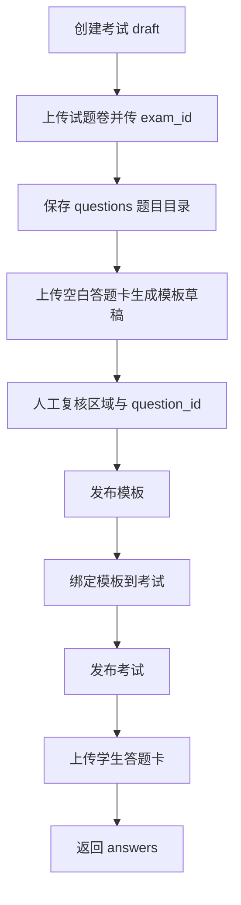

# 考试文件识别模块工作流接入指南

## 1. 模块职责与边界

本模块接收试题卷或答题卡文件，输出结构化试题或结构化学生答案；不负责评分、答案比对、学生信息识别或业务数据入库。

输出契约固定为 `exam-document.v1`。机器可校验定义见 [JSON Schema](../contracts/exam-document.v1.schema.json)，字段级接口定义见 [API 接口文档](考试文件识别API接口文档.md)。

服务地址：`http://127.0.0.1:8000`

启动服务：

```powershell
.\scripts\start_api_ocr.ps1
```

启动后先检查：

```powershell
curl.exe http://127.0.0.1:8000/health
```

期望结果中的 `paddleocr`、`paddlepaddle`、`opencv` 均为 `true`。`/docs` 可打开服务自动生成的 OpenAPI 页面。

## 2. 两种调用模式

| 模式 | 输入 | 必填参数 | 输出 | 使用时机 |
|---|---|---|---|---|
| 试题卷识别 | 自由版式试题 PDF/图片/DOCX | `document_role=question_paper`；要创建答题卡模板时还需 `exam_id` | `questions[]` | 首次建立考试题目目录 |
| 答题卡识别 | 已绑定固定模板的学生答题卡 | `document_role=answer_sheet`、`exam_id` | `answers[]` | 学生提交答题卡后 |

答题卡识别不接收 `template_id`。工作流只能提交 `exam_id`，服务端会查询该考试已绑定且已发布的模板。这是为了避免学生答题卡被错误地套用到其他考试模板。

## 3. 完整工作流



顺序不可颠倒：模板草稿需要读取题目目录；考试发布前必须已经绑定模板；答题卡识别需要已绑定模板。

## 4. 考试建立与试题卷识别

### 4.1 创建考试

请求：`POST /api/exams`

```powershell
curl.exe -X POST http://127.0.0.1:8000/api/exams `
  -H "Content-Type: application/json" `
  -d '{"exam_id":"mayuan_1516","exam_name":"马原15-16期末试卷","status":"draft"}'
```

规则：

- `exam_id` 是稳定的机器标识，建议使用 ASCII、短横线和下划线，例如 `mayuan_1516`。
- `exam_name` 是面向教师的名称，例如“马原15-16期末试卷”。
- 新考试必须为 `draft`，因为只有 `draft` 考试可以绑定模板。

### 4.2 上传试题卷并建立题目目录

请求：`POST /api/process`，请求类型为 `multipart/form-data`。

```powershell
curl.exe -X POST http://127.0.0.1:8000/api/process `
  -F "file=@E:\samples\15-16马原考试试题.pdf" `
  -F "document_role=question_paper" `
  -F "exam_id=mayuan_1516" `
  -F "submission_id=mayuan_1516_question_paper_v1"
```

成功响应示例：

```json
{
  "schema_version": "exam-document.v1",
  "submission_id": "mayuan_1516_question_paper_v1",
  "exam_id": "mayuan_1516",
  "exam_name": "马原15-16期末试卷",
  "document_role": "question_paper",
  "layout_type": "free",
  "questions": [
    {
      "question_id": "2.1",
      "question_no": "2.1",
      "question_text": "题干内容",
      "page_nos": [2],
      "confidence": 0.96,
      "needs_review": false,
      "risk_flags": []
    }
  ]
}
```

工作流必须保存该响应，特别是 `questions[].question_id`。提交了 `exam_id` 时，服务端也会把这组题目写入该考试的题目目录。

### 4.3 核对题目目录

请求：`GET /api/exams/mayuan_1516/questions`

```powershell
curl.exe http://127.0.0.1:8000/api/exams/mayuan_1516/questions
```

在创建模板前，工作流应核对题目数量与 `question_id`。例如马原 15-16 当前识别结果为：`1.1`、`1.2`、`1.3`、`1.4`、`2.1`、`2.2`。

`question_id` 是跨模块唯一关联键：

```text
questions[].question_id == 模板区域.question_id == answers[].question_id
```

不得用答题卡上的印刷题号、数组下标或 `question_no` 代替它。

## 5. 答题卡模板制作与绑定

### 5.1 生成模板草稿

请求：`POST /api/templates/drafts`。

```powershell
curl.exe -X POST http://127.0.0.1:8000/api/templates/drafts `
  -F "file=@E:\samples\马原15-16空白答题卡.pdf" `
  -F "template_id=tpl_mayuan_1516_v1" `
  -F "template_name=马原15-16答题卡" `
  -F "version=1" `
  -F "exam_id=mayuan_1516"
```

前置条件：`exam_id` 已存在且已有试题卷题目目录。`version` 必须显式给出正整数。

服务会读取空白答题卡中的印刷题号与位置，生成 `pending_review` 草稿，并按页面阅读顺序将候选区域映射到题目目录。原印刷题号保留在 `template_label`；规范关联 ID 写入 `question_id`。

### 5.2 读取并复核模板

读取：`GET /api/templates/tpl_mayuan_1516_v1`

模板中的每一页包含 `reference_width`、`reference_height` 和 `regions[]`。复核后通过 `PUT /api/templates/{template_id}/review` 保存完整的 `pages` 数组。

区域最小结构：

```json
{
  "question_id": "2.1",
  "question_no": "2.1",
  "template_label": "1",
  "order": 1,
  "bbox": [0.08, 0.16, 0.92, 0.30],
  "coordinate_type": "normalized",
  "content_type": "answer",
  "ocr_mode": "handwriting",
  "needs_review": false
}
```

字段约束：

- `bbox` 为 `[x1, y1, x2, y2]`，均是 0 到 1 的归一化坐标，且 `x1 < x2`、`y1 < y2`。
- `content_type` 对答题区必须是 `answer`。
- 同一题有多个书写区时，多个区域使用相同 `question_id`，但 `order` 必须不同。
- 人工新增区域时，`question_id` 只能从 `GET /api/exams/{exam_id}/questions` 返回的目录中选择。
- 所有区域确认后，必须将 `needs_review` 改为 `false`。

复核请求结构：

```json
{
  "pages": [
    {
      "page_no": 1,
      "reference_width": 2480,
      "reference_height": 3508,
      "reference_image_path": "page_001.png",
      "regions": []
    }
  ],
  "publish": false
}
```

### 5.3 发布并绑定模板

先发布模板：

```powershell
curl.exe -X POST http://127.0.0.1:8000/api/templates/tpl_mayuan_1516_v1/publish
```

再绑定到考试：

```powershell
curl.exe -X POST http://127.0.0.1:8000/api/exams/mayuan_1516/template `
  -H "Content-Type: application/json" `
  -d '{"template_id":"tpl_mayuan_1516_v1"}'
```

绑定阶段服务端会拒绝以下情况：

- 考试不存在，或考试不是 `draft`。
- 模板不是 `published`。
- 模板没有明确的正整数 `version`。
- 模板答题区域的 `question_id` 与题目目录不一致。
- 该考试已有成功答题卡提交且请求更换为其他模板。

模板绑定完成后，发布考试：

```powershell
curl.exe -X PATCH http://127.0.0.1:8000/api/exams/mayuan_1516/status `
  -H "Content-Type: application/json" `
  -d '{"status":"published"}'
```

发布后的考试不允许重新绑定或更换模板。

## 6. 学生答题卡识别

请求：`POST /api/process`。

```powershell
curl.exe -X POST http://127.0.0.1:8000/api/process `
  -F "file=@E:\samples\student_001_answer_sheet.pdf" `
  -F "document_role=answer_sheet" `
  -F "exam_id=mayuan_1516" `
  -F "submission_id=mayuan_1516_student_001"
```

服务端会依次执行：页面渲染、与空白模板对齐、按模板区域裁剪、空白检测、区域 OCR、同题多区域合并，最后写入答题卡提交台账。台账存在后不能更换模板。

成功响应：

```json
{
  "schema_version": "exam-document.v1",
  "submission_id": "mayuan_1516_student_001",
  "exam_id": "mayuan_1516",
  "exam_name": "马原15-16期末试卷",
  "document_role": "answer_sheet",
  "layout_type": "fixed",
  "template_id": "tpl_mayuan_1516_v1",
  "template_name": "马原15-16答题卡",
  "template_version": 1,
  "answers": [
    {
      "question_id": "2.1",
      "question_no": "2.1",
      "answer_text": "学生作答文本",
      "is_blank": false,
      "page_nos": [1],
      "confidence": 0.83,
      "needs_review": false,
      "risk_flags": []
    }
  ]
}
```

工作流消费规则：

- 只通过 `question_id` 将 `answers[]` 与 `questions[]` 关联。
- `answer_text` 可为空；结合 `is_blank` 判断是否为空白答题区。
- `needs_review=true` 表示结果不能直接作为可靠识别结果，应进入人工复核或异常队列。
- `risk_flags` 是原因集合，常见值包括 `page_alignment_low_confidence`、`page_alignment_failed`、`low_ocr_confidence`、`page_count_mismatch`、`region_processing_failed`。
- `template_version` 必须与业务侧记录的考试模板版本一致。

## 7. 字段说明

### 7.1 试题 `questions[]`

| 字段 | 类型 | 含义 |
|---|---|---|
| `question_id` | string | 稳定关联 ID，唯一业务主键 |
| `question_no` | string | 展示题号，例如 `2.1` |
| `question_text` | string | 识别出的题干文本 |
| `page_nos` | integer[] | 题目所在页码 |
| `confidence` | number | 0 到 1 的识别置信度 |
| `needs_review` | boolean | 是否建议人工复核 |
| `risk_flags` | string[] | 风险标记 |

### 7.2 答案 `answers[]`

| 字段 | 类型 | 含义 |
|---|---|---|
| `question_id` | string | 必须与题目目录完全一致 |
| `question_no` | string | 展示题号 |
| `answer_text` | string | 区域 OCR 后合并的答案文本 |
| `is_blank` | boolean | 答题区域是否被判为空白 |
| `page_nos` | integer[] | 答案涉及页码 |
| `confidence` | number | 页面对齐与 OCR 置信度综合值，范围 0 到 1 |
| `needs_review` | boolean | 是否需要人工复核 |
| `risk_flags` | string[] | 异常或风险原因 |

## 8. 异常处理与重试

| HTTP 状态 | 典型错误 | 工作流处理建议 |
|---:|---|---|
| 400 | 上传文件为空或类型不支持 | 直接失败，要求重新提供文件 |
| 404 | `exam_id` 或 `template_id` 不存在 | 配置错误，停止并通知考试配置流程 |
| 422 | `TEMPLATE_NOT_BOUND`、模板未发布、题目 ID 不一致、考试状态不允许绑定 | 配置错误，不能对同一请求盲目重试 |
| 503 | `OCR_DEPENDENCY_MISSING` | 服务运行环境异常，可在修复依赖后重试 |
| 500 | OCR 或内部处理异常 | 记录 `submission_id`、请求参数和错误体，按业务策略有限重试或转人工 |

对于答题卡提交，应由调用方生成稳定的 `submission_id`。使用同一 `submission_id` 重试时，必须保证仍属于同一考试和模板；服务端会拒绝该 ID 被关联到其他考试或模板。

## 9. 版本兼容规则

- 调用方收到响应后先检查 `schema_version == "exam-document.v1"`。
- `v1` 内只会新增可选字段，不删除字段、不改变已有字段类型或语义。
- 若字段类型、必填性或语义发生不兼容变化，服务会发布新的主版本，例如 `exam-document.v2`。
- 调用方不应把未知版本按 `v1` 解析。
